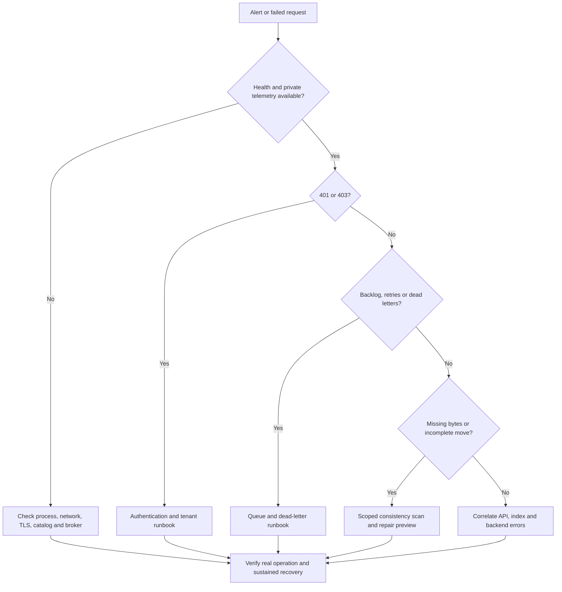

# Incident, queue, and repair runbooks

Use these procedures with the installed release's CLI and the deployment's
existing catalog, drivers, broker topology, and security configuration. Commands
run on a trusted operator host; local CLI access is not an authenticated tenant
API. Keep collected reports and logs in restricted incident storage. The
[recorded operator drill](evidence/m4/README.md) exercises an interrupted move,
preview, repair, and a fresh consistency scan on disposable local data.

The selected M5 deployment's [recovery qualification campaign](recovery_qualification.md)
adds repeated transfer/publication and dependency faults, uncertain REST
submission reconciliation, identity/trust rotation, and tenant-bound evidence
requirements. Complete its reconciliation before reopening ordinary work.

## First response and decision tree

**Triage.** Record UTC onset, deployment version, recent changes, alert labels,
affected tenant/scope, request/correlation IDs, job IDs, and move IDs. Check
private operator endpoints from the service host (default local ports shown):

```bash
curl --fail-with-body --show-error http://127.0.0.1:8080/healthz
curl --fail-with-body --show-error http://127.0.0.1:8081/healthz
curl --fail-with-body --show-error http://127.0.0.1:8081/readyz
```

Use the configured HTTPS endpoints in production. Worker `/healthz` contains
a cached bus snapshot; `/readyz` performs a fresh broker probe and returns 503
while the worker cannot accept claims. A healthy API process alone does not
prove that catalog, storage, authentication, or queued work succeeds. Capture
the response bodies even when curl reports a nonzero status.



**Action.** For dependency failure, restore the failing service or valid
configuration before restarting consumers. For a deployment regression, use
the [upgrade and rollback procedure](operator_lifecycle.md#rollback). Reduce or
pause the affected producers while preserving broker and catalog state. Use
[security triage](operator_security.md#authentication-and-tenant-failures) for
authorization failures. For indexing, separate queue wait from extractor,
embedding, and index-provider errors using correlated scan logs and traces.

**Verify.** Exercise one authorized operation in the affected scope; confirm
its terminal result and new successful metrics. Inspect queue progress as well
as short and long SLO burn windows. An empty denominator, cleared alert caused
by missing telemetry, or a successful health check is insufficient recovery.

**Escalate.** Immediately involve the storage owner for absent/corrupt data or
uncertain source deletion, the security owner for unauthorized access or audit
integrity failures, and the service owner for critical SLO burn. Assign these
roles to named on-call teams before deployment; the bundled Prometheus profile
does not dispatch notifications. Retain evidence, actions, verification results,
remaining error budget, and follow-up owner in the incident record.

## Queue backlog and saturation

**Triage.** Inspect worker `/readyz` fields for pending jobs, outstanding ACKs,
active IDs, stored messages/bytes, retry/dead-letter counts, and last error.
Compare with Prometheus `max(cognistore_job_queue_depth{state="pending"})`;
workers share the durable consumer, so adding their depths overcounts. Check
the deployment's stream and consumer names before using broker administration
tools. Defaults are `COGNISTORE_JOBS` and `cognistore-workers`.

| Observation | Next action |
| --- | --- |
| Ready workers, backlog falling, backend load within limits | Continue watching drain rate; avoid a needless restart. |
| Worker unready or no completions | Restore catalog/broker/storage connectivity; inspect TLS, credentials, and the last error. |
| Many retries, backend 429/timeouts, tier throttling | Reduce admissions or per-process tier rates; repair the backend before increasing worker count. |
| Queue rejects new publications | Slow producers and retain their retry state; ACKed jobs free capacity. |
| Local in-flight slots full but no progress | Inspect active move leases, dependency latency, and tier waiters; do not force-clear leases. |
| Startup reports stream/consumer settings mismatch | Reconcile the documented topology through a coordinated maintenance change. |

**Action.** Stop or rate-limit the affected publishers first. Preserve uncertain
submission IDs and retry with the same `--job-id` within the deduplication
window. Main-stream defaults are 10,000 messages, 1 GiB, and `DiscardNew`;
publication can fail below 100% byte utilization when the next message will
not fit. Never delete/recreate the stream to clear an incident. Before changing
capacity, compare the actual configuration with
[bounded concurrency and backpressure](background_workers.md#bounded-concurrency-rates-and-backpressure).
All processes sharing a stream must agree on its limits and shared
`--max-ack-pending`; workers validate existing configuration rather than rewrite
it. Use the documented coordinated broker-edit procedure for a topology change.

Scale consumers only after checking backend and catalog capacity. Tier limits
are process-local, so extra workers multiply load. A valid `worker --tier-limits`
file can be reloaded with `SIGHUP`; tier names and admission queue size need a
restart. SIGTERM drains in-flight work, and a blocked storage thread can keep
the process draining until its side-effect boundary. Avoid force killing a
worker merely to make readiness green.

**Verify.** Confirm ready consumers, continuing completions/ACKs, falling
pending and oldest-job age, and declining retry rates. Check that a representative
new submission completes. The capacity alert needs a drop below 10,000 pending
jobs; a throughput alert clearing because its cohort became idle does not
prove the backlog recovered. A queue at exactly its configured message cap can
reject publications without satisfying the shipped `> 10000` alert condition.

**Escalate.** Involve the broker/platform owner if no consumer can claim work,
storage owner for sustained throttling, and service owner if drain time exceeds
the affected workload's SLO. Preserve topology settings and queue counters;
do not paste job payloads or credentials into shared tickets.

## Dead-letter diagnosis and redrive

**Triage.** Obtain `dead_letter_id` from the worker's structured failure log and
correlate job ID, original principal/tenant, attempt history, classification,
reason, and move journal. There is no shipped `dead-letter-list` CLI command.
Use restricted broker tooling when the retained diagnostic record is needed;
records are chunked and checksummed, and the manifest is not the complete
payload. Retention defaults to 30 days. Preserve evidence before it expires.

Transient network/5xx/throttle failures receive bounded exponential retries
(default seven attempts); invalid requests, permission failures, collisions,
and proven integrity mismatches are terminal. An exhausted transient failure
still needs its cause fixed before redrive. Check the original tenant and
current RBAC bindings; redrive preserves identity and cannot grant permission.
For scheduled work with stale execution ownership, follow the exact-owner
[fenced recovery procedure](background_workers.md#recover-a-stale-scheduled-run)
before redrive; lease expiry alone is not proof the old worker cannot act.

**Action.** After resolving the cause, set the real UUID and retain the exact
broker configuration used by the failed worker:

```bash
DEAD_LETTER_ID='00000000-0000-0000-0000-000000000001' # replace from the failure log
cognistore dead-letter-redrive "$DEAD_LETTER_ID" --dry-run --json
cognistore dead-letter-redrive "$DEAD_LETTER_ID" --json
```

The preview only validates/canonicalizes the ID and reports
`existence_checked: false`. It does not contact NATS or establish replay safety.
The second command publishes real work. Use it only after checking the retained
entry and its cause; keep queue URL/credentials in the existing protected
configuration. Override global stream, subject, and DLQ options when the
deployment does not use defaults. Do not pass `--catalog-db` to redrive: the
worker owns the catalog used for execution.

Redrive retains the logical job ID and payload, writes immutable intent and
completion evidence, and uses a new transport identity. A repeated completed
redrive returns the existing result. If the command loses connectivity after
publication, retry the same dead-letter ID and inspect the audit outcome;
delivery remains at least once. Malformed envelopes cannot be repaired through
redrive. Do not edit principal/tenant metadata or publish a forged replacement.

**Verify.** A redrive command's success proves publication, not job completion.
Follow the job through worker logs and, for an authorized client,
`GET /v1/jobs/{job_id}`. Confirm terminal success, expected storage/catalog
state, no new dead letter, and declining retries. For a move, inspect its
journal or run a scoped consistency check; check original and redrive audit
links remain available.

**Escalate.** Quarantine malformed/integrity/collision failures for the storage
and service owners. Involve security for revoked or mismatched tenant identities.
For payload-size/headroom or expired diagnostics, retain the error and audit
intent rather than constructing a different logical job to bypass safeguards.

## Interrupted move and consistency repair

**Triage.** Confirm the old process is stopped or otherwise unable to write,
and allow its move lease to expire before another owner attempts recovery.
Preserve a consistent backup and restrict writes to the affected scope while
investigating. On the trusted single-tenant catalog, inspect the stored journal:

```bash
cognistore --catalog-db /var/lib/cognistore/catalog.sqlite3 \
  move-list --state prepared --state transferred --state verified \
  --state committed --state cleanup --json
cognistore --catalog-db /var/lib/cognistore/catalog.sqlite3 \
  move-status "$MOVE_ID" --json
```

Use the existing PostgreSQL locator instead for that deployment. These local
commands do not authenticate or switch to an API tenant. The consistency CLI's
`--tenant` selects a trusted bucket/prefix scope from its scope file; it is not
`COGNISTORE_TENANT_POLICY` membership and does not select a tenant catalog
partition. Do not point it at a tenant-enabled deployment's default catalog
and claim that the result covers non-default partitions. Non-default tenant
recovery requires an operator-reviewed, explicitly tenant-bound catalog and
storage workflow; preserve the isolation described in [tenancy](tenancy.md).

**Action.** The following complete example applies to an existing trusted local
catalog with logical keys under `customer-data/acme/`, and configured `hot` and
`warm` tiers. Adapt the scope to the actual namespace, keep the file operator
owned, and place reports outside every POSIX tier root:

```yaml
# /etc/cognistore/consistency-scopes.yaml
tenants:
  acme:
    bucket: customer-data
    prefix: acme/
    tiers: [hot, warm]
```

```bash
mkdir -p /var/lib/cognistore/reports
cognistore --drivers /etc/cognistore/drivers.yaml \
  --catalog-db /var/lib/cognistore/catalog.sqlite3 \
  consistency-scan --tenant acme \
  --scope-config /etc/cognistore/consistency-scopes.yaml \
  --report /var/lib/cognistore/reports/incident-acme.sqlite3 --json

cognistore --drivers /etc/cognistore/drivers.yaml \
  --catalog-db /var/lib/cognistore/catalog.sqlite3 \
  consistency-repair --tenant acme \
  --scope-config /etc/cognistore/consistency-scopes.yaml \
  --report /var/lib/cognistore/reports/incident-acme.sqlite3 --dry-run --json
```

Require `summary.complete: true` before repair. Resume a paused scan with the
same settings and `--resume`. Inspect `summary.actions` and `summary.counts`;
CLI success does not imply consistency. The scan leaves backend/catalog data
unchanged but writes the report. Repair `--dry-run` leaves the report unchanged
too; omitting both repair flags stores an audited plan only in the report.
Neither preview is permission to skip the current-state checks.

After reviewing the plan and backing up evidence, execute the same repair with
`--enable-repair` in place of `--dry-run`. It only resumes an existing eligible
nonterminal move with its original idempotency key. Live leases, holds, locality
constraints, missing full-checksum evidence, changed generations, failed jobs,
and ambiguous copies prevent automatic repair. Quarantine is an audit decision,
not movement or deletion of suspect bytes. Never delete duplicate/source copies
manually to make a finding disappear. Verification read throttles do not limit
the mover's transfer/cleanup bandwidth; schedule repairs within backend capacity.

For a known manual move, `move-resume "$MOVE_ID" --dry-run --json` followed by
the same command without `--dry-run` is the narrower
[journal recovery workflow](cli.md#durable-manual-move-recovery), with the same
global drivers/catalog options. That preview does not probe all live recovery
preconditions. Failed moves remain terminal; do not invent a new key to bypass
the recorded integrity reason.

**Verify.** Re-run `move-status` and confirm `completed`, the original ID, and
expected destination placement. Create a **new** report path and run the same
scoped scan again; require both `summary.complete` and `summary.consistent` for
an all-clear. Repeating enabled repair should resolve the historical finding
without creating another move. Export the original report and retain its audit
checkpoint as described in [consistency checks](consistency_checks.md#export-and-audit).
The original findings remain historical, so they are not recovery verification.

**Escalate.** Stop automatic repair on checksum/size mismatch, missing bytes,
unexpected generation, report binding/integrity failure, or continued quarantine.
Give the storage owner scoped evidence and verified backup locations. Escalate
holds/locality decisions to their policy owner; release/override is a separate
audited operation. Resume affected producers after service and data verification.
