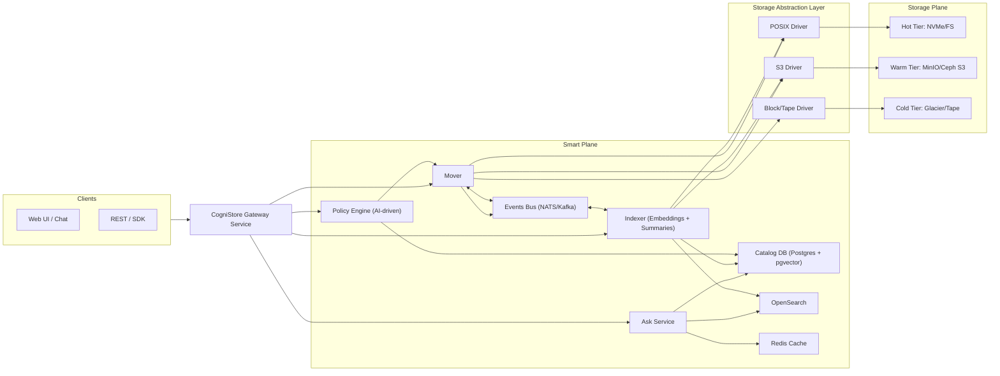
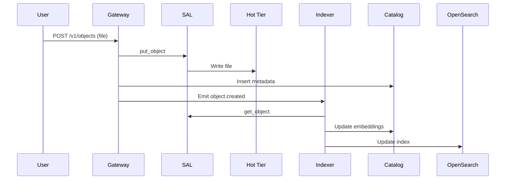
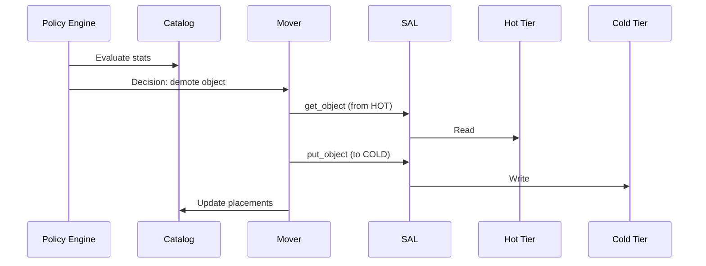

# CogniStore: An AI-Powered Data Lifecycle Manager

## 1. Vision — CogniStore

**CogniStore** is an AI-Powered Data Lifecycle Manager, a next-generation data lifecycle management platform that unifies diverse storage backends into a single, intelligent system.
At its core, the system presents a **universal object API**, so that users and applications can store, retrieve, and query data without needing to understand or manage the complexity of the underlying storage hardware.

### What the system is
- A **modular, pluggable orchestration layer** that sits above multiple storage devices, file systems, and object stores.
- A **knowledge-aware storage system** that not only stores bytes but also indexes and summarizes them for fast semantic queries.
- An **AI-driven hierarchical storage manager (HSM)** that continuously optimizes where data lives based on cost, performance, and sustainability goals.

### What the system does
- **Abstracts away complexity**: Users interact via a simple API or chat interface. They no longer need to worry about tiering, migration, or backend specifics.
- **Automates tiering and movement**: Frequently used data is kept on faster storage, while rarely used data is moved to cheaper, colder tiers—all without manual rules.
- **Provides a knowledge base**: Files are automatically indexed, embedded, and summarized so users can ask questions directly and receive semantic answers without retrieving raw files.
- **Optimizes for cost, carbon, and compliance**: Decisions consider not just performance, but also financial cost, carbon footprint, and data locality requirements.

### Why this is important
Traditional HSM systems from the 80s–2000s focused on tape libraries and simple LRU-based policies. They were:
- **Rule-based and static**: admins wrote manual rules for migration policies, which often became stale.
- **Backend-specific**: designed for one type of file system or tape, not pluggable into modern cloud or hybrid environments.
- **Opaque to users**: lacked user-facing interfaces that made data truly discoverable or queryable.

Modern cloud storage systems (like AWS S3, Glacier, or Google Cloud Storage) provide scalable backends, but they are:
- **Isolated**: each vendor provides siloed APIs, making multi-cloud or hybrid difficult.
- **Blind to knowledge**: they store data but don’t understand its meaning.
- **Expensive and inefficient**: without intelligent tiering, costs rise as data grows.

This project addresses those gaps by:
- Providing a **vendor-neutral abstraction** across file, block, and object.
- Integrating **AI for intelligent tiering and summarization**.
- Embedding **sustainability and compliance goals** into core decision-making.

In short, the CogniStore: An AI-Powered Data Lifecycle Manager makes data storage **smarter, greener, and more user-friendly**. It bridges the gap between legacy HSM, modern object storage, and future AI-powered knowledge systems.


## 2. Core Components

### 2.1 Gateway
- Entry point for users (REST, SDKs, chat).
- Handles auth, routes requests.

### 2.2 Smart Plane (Brains)
- **Catalog (Postgres + pgvector)**: metadata, tier state, replicas, SLOs.
- **Indexer**: extract text, embeddings, summaries.
- **Knowledge Base Ask Service**: semantic queries with summaries & embeddings.
- **OpenSearch**: keyword search.
- **Redis**: hot cache.
- **Policy Engine**: AI placement decisions.
- **Mover**: executes placement changes.
- **Event Bus (NATS/Kafka)**: decoupled messaging.

### 2.3 Storage Abstraction Layer (SAL)
- Unified **object-style API**: `put_object`, `get_object`, `delete`, `list`, `stat`.
- Wrappers:
  - **POSIX Facade**: files as objects.
  - **S3 Driver**: MinIO, Ceph, AWS.
  - **Block Facade**: block devices as objects.
- Config-driven (`drivers.yaml`) → unlimited devices.

### 2.4 Storage Plane
- Pluggable storage devices grouped into **pools** and labeled into **tiers**.
- Examples:
  - Hot: NVMe local FS
  - Warm: MinIO cluster
  - Cold: Glacier / Tape / Block

---

## 3. Metadata & Indexing
- **Catalog DB** (Postgres + pgvector) → metadata, tier state, placements.
- **Embeddings** in pgvector.
- **Snippets** in OpenSearch.
- **Summaries** stored in warm tier.
- **Audit trail** for moves/deletes.
- Independent from storage backends.

---

## 4. Policy Engine
- Features: recency, frequency, importance, size, SLOs, cost, carbon, geography.
- Models:
  - Supervised classifier (MVP).
  - Contextual bandits.
  - RL (future).
- Budget/carbon-aware knapsack optimization.
- Explainable: logs reasons for each decision.
- Safety: hysteresis, cooldowns, min residency timers, compliance guardrails.

---

## 5. Schema Design

### Objects
```sql
CREATE TABLE objects (
  object_id UUID PRIMARY KEY,
  bucket TEXT,
  key TEXT,
  size BIGINT,
  checksum TEXT,
  importance REAL,
  slo_class TEXT,
  created_at TIMESTAMPTZ DEFAULT now(),
  last_accessed TIMESTAMPTZ,
  deleted BOOLEAN DEFAULT false
);
```

### Object Placements
```sql
CREATE TABLE object_placements (
  placement_id BIGSERIAL PRIMARY KEY,
  object_id UUID REFERENCES objects(object_id) ON DELETE CASCADE,
  device_id TEXT,
  pool_id TEXT,
  region TEXT,
  tier_label TEXT,
  replica_role TEXT DEFAULT 'primary',
  created_at TIMESTAMPTZ DEFAULT now(),
  last_moved_at TIMESTAMPTZ
);
```

### Devices
```sql
CREATE TABLE devices (
  device_id TEXT PRIMARY KEY,
  driver TEXT NOT NULL,
  endpoint TEXT,
  region TEXT,
  latency_ms REAL,
  throughput_gbps REAL,
  capacity_gb BIGINT,
  cost_per_gb_month REAL,
  carbon_g_per_gb REAL
);
```

### Pools
```sql
CREATE TABLE pools (
  pool_id TEXT PRIMARY KEY,
  region TEXT NOT NULL,
  description TEXT
);
CREATE TABLE pool_memberships (
  pool_id TEXT REFERENCES pools(pool_id),
  device_id TEXT REFERENCES devices(device_id),
  PRIMARY KEY(pool_id, device_id)
);
```

---

## 6. Storage Abstraction Layer

### storage_driver.py
```python
from abc import ABC, abstractmethod
from typing import Optional, Generator, Dict, Any

class StorageDriver(ABC):
    def put_object(self, bucket: str, key: str, data: bytes, range: Optional[str] = None, **opts) -> None:
        pass

    def get_object(self, bucket: str, key: str, range: Optional[str] = None) -> bytes:
        pass

    def delete_object(self, bucket: str, key: str) -> None:
        pass

    def list_objects(self, bucket: str, prefix: str = "") -> Generator[str, None, None]:
        pass

    def stat_object(self, bucket: str, key: str) -> Dict[str, Any]:
        pass
```

### posix_driver.py
```python
import os
from pathlib import Path
from typing import Generator, Dict, Any
from storage_driver import StorageDriver

class PosixDriver(StorageDriver):
    def __init__(self, base_path: str):
        self.base = Path(base_path)
        self.base.mkdir(parents=True, exist_ok=True)

    def _path(self, bucket: str, key: str) -> Path:
        return self.base / bucket / key

    def put_object(self, bucket: str, key: str, data: bytes, range=None, **opts) -> None:
        path = self._path(bucket, key)
        path.parent.mkdir(parents=True, exist_ok=True)
        if range:
            start, end = [int(x) for x in range.replace("bytes=", "").split("-")]
            with open(path, "r+b") as f:
                f.seek(start)
                f.write(data[: end - start + 1])
        else:
            with open(path, "wb") as f:
                f.write(data)

    def get_object(self, bucket: str, key: str, range=None) -> bytes:
        path = self._path(bucket, key)
        with open(path, "rb") as f:
            blob = f.read()
        if range:
            start, end = [int(x) for x in range.replace("bytes=", "").split("-")]
            return blob[start:end+1]
        return blob

    def delete_object(self, bucket: str, key: str) -> None:
        path = self._path(bucket, key)
        path.unlink(missing_ok=True)

    def list_objects(self, bucket: str, prefix="") -> Generator[str, None, None]:
        base = self.base / bucket
        if not base.exists():
            return
        for root, _, files in os.walk(base):
            for name in files:
                rel = os.path.relpath(os.path.join(root, name), base)
                if rel.startswith(prefix):
                    yield rel

    def stat_object(self, bucket: str, key: str) -> Dict[str, Any]:
        path = self._path(bucket, key)
        st = path.stat()
        return {"size": st.st_size, "mtime": st.st_mtime, "path": str(path)}
```

### s3_driver.py
```python
import boto3
from typing import Generator, Dict, Any
from storage_driver import StorageDriver

class S3Driver(StorageDriver):
    def __init__(self, endpoint_url: str, access_key: str, secret_key: str, region: str = "us-east-1"):
        self.s3 = boto3.client(
            "s3",
            endpoint_url=endpoint_url,
            aws_access_key_id=access_key,
            aws_secret_access_key=secret_key,
            region_name=region,
        )

    def put_object(self, bucket, key, data: bytes, range=None, **opts):
        if range:
            raise NotImplementedError("Range writes not supported for S3")
        self.s3.put_object(Bucket=bucket, Key=key, Body=data, **opts)

    def get_object(self, bucket, key, range=None) -> bytes:
        kwargs = {}
        if range:
            kwargs["Range"] = range
        resp = self.s3.get_object(Bucket=bucket, Key=key, **kwargs)
        return resp["Body"].read()

    def delete_object(self, bucket, key):
        self.s3.delete_object(Bucket=bucket, Key=key)

    def list_objects(self, bucket, prefix="") -> Generator[str, None, None]:
        paginator = self.s3.get_paginator("list_objects_v2")
        for page in paginator.paginate(Bucket=bucket, Prefix=prefix):
            for obj in page.get("Contents", []):
                yield obj["Key"]

    def stat_object(self, bucket, key) -> Dict[str, Any]:
        resp = self.s3.head_object(Bucket=bucket, Key=key)
        return {"size": resp["ContentLength"], "mtime": resp["LastModified"].timestamp()}
```

### block_driver.py
```python
import os
from typing import Dict, Any, Generator
from storage_driver import StorageDriver

class BlockDriver(StorageDriver):
    def __init__(self, base_path="/dev"):
        self.base_path = base_path

    def _path(self, bucket: str, key: str) -> str:
        return os.path.join(self.base_path, key)

    def put_object(self, bucket, key, data: bytes, range=None, **opts):
        path = self._path(bucket, key)
        with open(path, "r+b", buffering=0) as f:
            if range:
                start, end = [int(x) for x in range.replace("bytes=", "").split("-")]
                f.seek(start)
                f.write(data[: end - start + 1])
            else:
                f.seek(0)
                f.write(data)

    def get_object(self, bucket, key, range=None) -> bytes:
        path = self._path(bucket, key)
        with open(path, "rb", buffering=0) as f:
            if range:
                start, end = [int(x) for x in range.replace("bytes=", "").split("-")]
                f.seek(start)
                return f.read(end - start + 1)
            return f.read()

    def delete_object(self, bucket, key):
        raise NotImplementedError("Cannot delete block devices")

    def list_objects(self, bucket, prefix="") -> Generator[str, None, None]:
        for name in os.listdir(self.base_path):
            if name.startswith(prefix):
                yield name

    def stat_object(self, bucket, key) -> Dict[str, Any]:
        path = self._path(bucket, key)
        st = os.stat(path)
        return {"size": st.st_size, "mtime": st.st_mtime, "path": path}
```


```python
class StorageDriver(ABC):
    def put_object(self, bucket: str, key: str, data: bytes, **opts): ...
    def get_object(self, bucket: str, key: str, range: str = None) -> bytes: ...
    def delete_object(self, bucket: str, key: str): ...
    def list_objects(self, bucket: str, prefix: str = "") -> List[str]: ...
    def stat_object(self, bucket: str, key: str) -> Dict: ...
```

Drivers implemented: `PosixDriver`, `S3Driver`, `BlockDriver`.
Configurable via `drivers.yaml`.

---

## 7. Config Loader

### driver_loader.py
```python
import yaml
from posix_driver import PosixDriver
from s3_driver import S3Driver
from block_driver import BlockDriver

def load_drivers(config_path="drivers.yaml"):
    with open(config_path) as f:
        cfg = yaml.safe_load(f)

    drivers = {}
    for tier, info in cfg["tiers"].items():
        if info["driver"] == "posix":
            drivers[tier] = PosixDriver(base_path=info["path"])
        elif info["driver"] == "s3":
            drivers[tier] = S3Driver(
                endpoint_url=info["endpoint"],
                access_key=info["access_key"],
                secret_key=info["secret_key"],
                region=info.get("region", "us-east-1")
            )
        elif info["driver"] == "block":
            drivers[tier] = BlockDriver(base_path=info.get("path", "/dev"))
        else:
            raise ValueError(f"Unknown driver type {info['driver']}")
    return drivers
```

### drivers.yaml
```yaml
tiers:
  hot:
    driver: posix
    path: /mnt/hot
  warm:
    driver: s3
    endpoint: http://localhost:9000
    access_key: minio
    secret_key: minio123
  cold:
    driver: block
    path: /dev
```

### Example Usage
```python
from driver_loader import load_drivers

drivers = load_drivers("drivers.yaml")

# Put object in hot tier (POSIX)
drivers["hot"].put_object("mybucket", "hello.txt", b"Hello Hot!")

# Copy to warm (S3)
data = drivers["hot"].get_object("mybucket", "hello.txt")
drivers["warm"].put_object("mybucket", "hello.txt", data)

# List in warm
print(list(drivers["warm"].list_objects("mybucket")))
```

```yaml
tiers:
  hot:
    driver: posix
    path: /mnt/hot
  warm:
    driver: s3
    endpoint: http://localhost:9000
    access_key: minio
    secret_key: minio123
  cold:
    driver: block
    path: /dev
```

---


## 7. System Architecture Diagram




## 8. Workflows

### Upload
1. User uploads → Gateway → SAL → Hot.
2. Catalog entry created.
3. Indexer extracts embeddings & summaries.
4. Embeddings → pgvector; snippets → OpenSearch; summaries → Warm.
5. Catalog updated.

### Ask
- Ask service queries Catalog, pgvector, OpenSearch.
- Responds with summary/semantic answer.

### Demotion
- Policy engine decides demotion.
- Mover copies via SAL.
- Catalog updates placements.
- Indexes remain accessible.

### Deletion
- User deletes object.
- Gateway issues deletes across placements.
- Catalog purged.
- Indexes cleaned up.

---

## 9. Sequence Diagrams

### Upload


### Demotion


---

## 10. Research Positioning
- **Traditional HSM**: rule-based (LRU, LFU, STR).
- **Recent RL-HSM (2022)**: RL-based migration.
- **Our approach**: AI policy + knowledge base + sustainability + explainability.
- Aligned with **cloud-native**, **AI/LLM pipelines**, **green computing**, **compliance**.

---

## 11. Next Steps
- Implement mover tied to Catalog + SAL.
- Integrate embeddings (sentence-transformers).
- Integrate summarizer (llama.cpp/Ollama).
- Build Ask API.
- Prototype ML-based policy engine.
- Demo full lifecycle.
