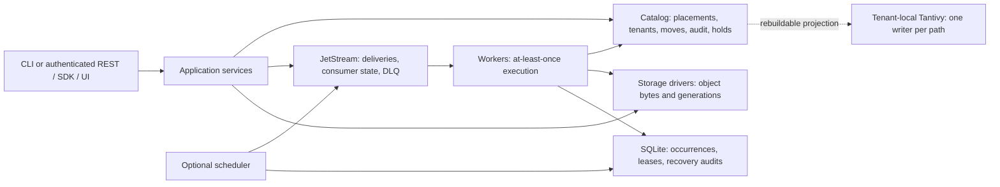
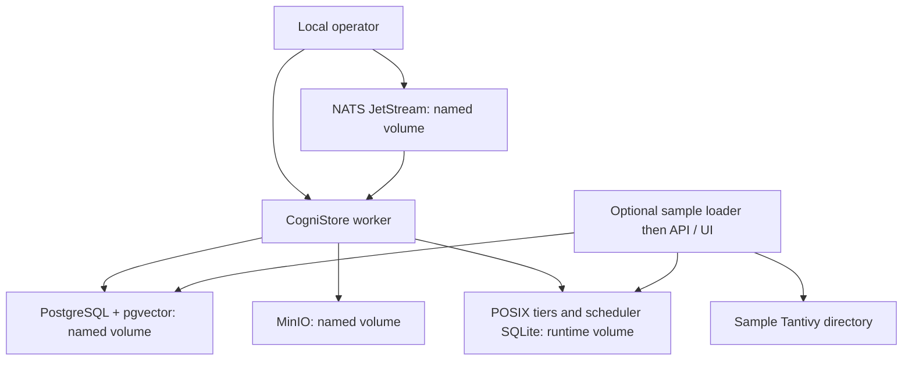
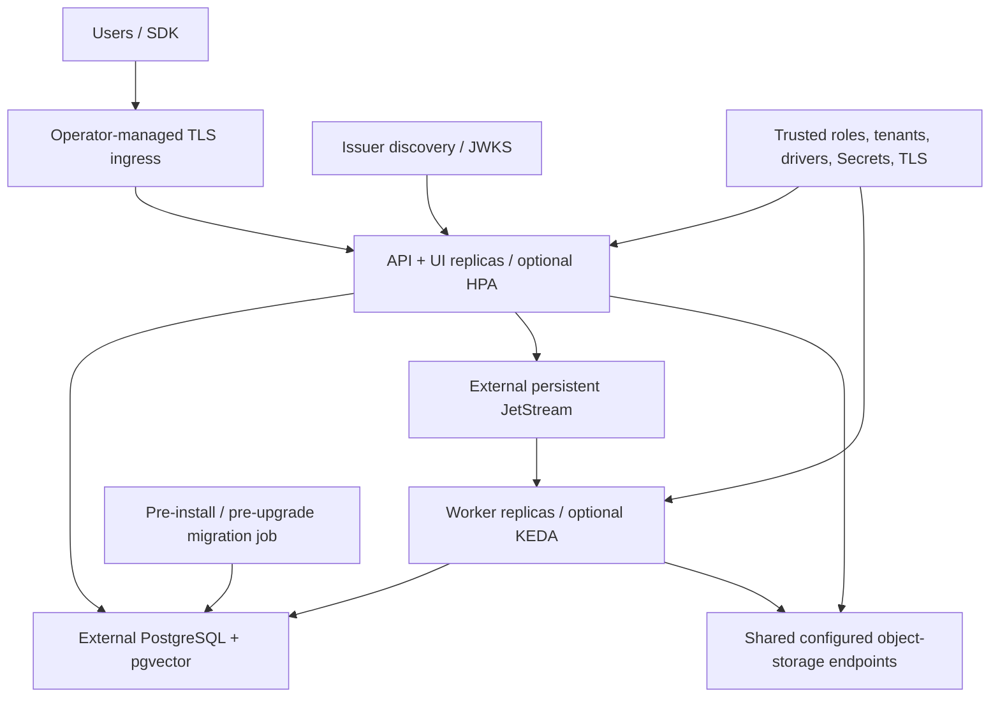
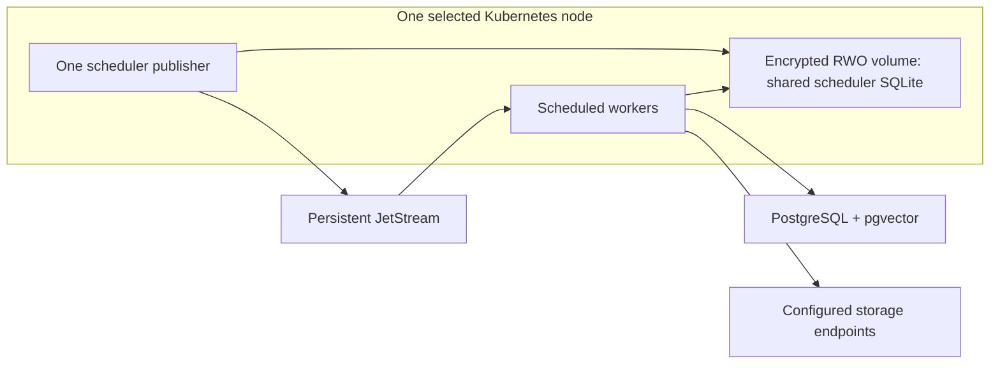
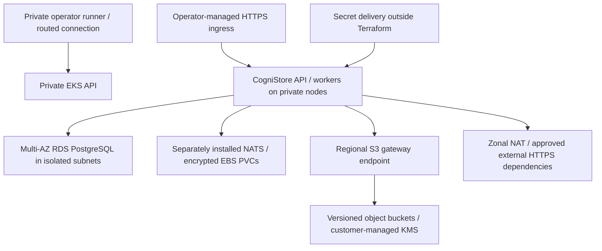

# Supported reference architectures

These deployment shapes describe the shipped runtime, Compose stack, Helm
chart, and AWS Terraform reference. They separate supported component
contracts from qualification evidence; a template or passing test is not a
promise of production availability. Use the
[operator handbook](operator_handbook.md) for operations and the
[migration runbook](operator_migrations.md) to move between these shapes.

## Select a deployment

| Shape | Intended use | Durable state and scaling boundary | Starting point |
| --- | --- | --- | --- |
| Local SQLite + POSIX | Operator development and isolated functional work | One host; SQLite catalog, optional scheduler file, local storage; no pgvector retrieval | [CLI](cli.md), [POSIX permissions](posix_containment.md) |
| Repository Compose | Disposable development, integration, and content-search sample | PostgreSQL/pgvector, file-backed JetStream, MinIO and runtime named volumes on one Docker host; development security profile | [Setup guide](setup_guide.md), [sample](content_search_sample.md) |
| Production Helm, scheduler disabled | API/UI and ordinary queued actions with independent worker replicas | External PostgreSQL/pgvector, JetStream and shared storage endpoints; API HPA and worker KEDA are opt-in | [Kubernetes](kubernetes.md) |
| Production Helm, scheduler enabled | Recurring work with the current SQLite coordinator | Scheduler and all scheduled workers share one persistent RWO volume on one node; no multi-host scheduler availability | [Scheduling](background_workers.md), [Kubernetes](kubernetes.md) |
| AWS Terraform + Helm | AWS infrastructure reference for the production chart | Private EKS API, private nodes, isolated Multi-AZ RDS, versioned S3/KMS; separately installed persistent NATS and application | [Terraform](terraform.md) |

POSIX, S3-compatible, GCS, and Azure Blob are implemented storage drivers. Azure
requires the `azure` Python extra, which is included in the development image
but not the default runtime image. The cloud drivers are not infrastructure
deployment references for GCP or Azure. There is no repository-managed
multi-region active-active deployment, distributed SQLite scheduler, or
multi-writer shared Tantivy index.

## State ownership common to every shape

The scheduler path applies only when scheduling is enabled. Catalog and
storage are authoritative for object state; the queue owns delivery state;
scheduler SQLite owns occurrence coordination. Back up these planes together.
PostgreSQL additionally owns embedding/model-space data. Tantivy is derived
from catalog extraction state and can be rebuilt during a quiesced or replayed
mutation window. Ask providers add optional retrieval/answer capabilities, not
a replacement source of truth. See [architecture](architecture.md),
[keyword recovery](keyword_search.md#rebuild-and-recovery), and
[backup and restore](operator_lifecycle.md#backup).

## Local development and Compose

`docker compose up --build --wait` starts the default worker and dependencies;
the API/UI sample is opt-in. Development endpoints use plaintext and public
disposable credentials. Compose is suitable for synthetic walkthroughs and
integration drills; changing a password does not establish production TLS,
tenancy, storage encryption, or dependency availability. Named volumes survive
ordinary stops, while volume deletion destroys that local recovery state.

For a SQLite-only session, use the same catalog contract with POSIX or a
configured cloud driver. Durable background jobs still require JetStream;
SQLite does not replace the broker. PostgreSQL is required for supported
pgvector similarity search. A local POSIX tier must satisfy the service-user
ownership, permissions, and trusted mutation model described in the
[containment guide](posix_containment.md).

## Production Helm with independent workers

The default chart disables the recurring scheduler and its workers reject
scheduled envelopes. Ordinary REST scan/policy jobs use PostgreSQL claims and
move journals. This supports replicas on different nodes when every replica
can reach the same configured storage. A POSIX path on unrelated node disks is
not shared storage merely because the YAML path is identical.

The chart ships API/UI, workers, migration and smoke-test jobs, private Service
resources, hardening and NetworkPolicy templates. Operators provide
PostgreSQL, JetStream, storage, credentials, verified TLS, identity service,
ingress, metrics adapters, and KEDA where enabled. The chart does not install a
shared keyword index or production model provider. Tenant APIs return 404 for
aggregate `/metrics`; use CPU or trusted per-pod ingress telemetry for HPA in
tenant mode. Scaling compute does not make the broker exactly-once, ensure
dependency capacity, or guarantee an SLO.

The production chart enables tenant isolation. Each exact tenant ID owns a
separate PostgreSQL schema and cloud/POSIX key prefix; pgvector is a shared
database extension with tenant-owned tables/indexes. All API and worker
replicas need the same trusted issuer/audience, role policy, tenant policy,
driver configuration, and catalog root. Broker publishing is a trusted
operator capability because jobs carry internal identity assertions. See
[tenancy](tenancy.md), [authentication](authentication.md), and
[encryption](encryption.md).

## Production Helm with recurring schedules

Enable `scheduler.enabled`, supply `schedules.yaml`, and configure
`scheduler.storage`; the chart pins workers to the scheduler's node and avoids
overlapping scheduler publishers during replacement. The file is shared by
all those workers. An RWX filesystem or a file per worker is not a supported
way to distribute coordination. A node loss may require volume reattachment
and manual fenced recovery of a stale running occurrence before work resumes.

Protected schedules assert one operator-configured service principal resolving
to one tenant. The scheduler does not fetch/validate a JWT; trusted local
configuration and restricted NATS access uphold that assertion. Pending jobs
retain their original identity and tenant. Changing the scheduler identity or
disabling scheduled work requires a planned drain and state-preserving
cutover, as described in [migrations](operator_migrations.md).

## AWS reference and responsibility boundary

Terraform owns the VPC, private EKS cluster/nodes, supporting add-ons, RDS,
object buckets, workload IAM role, encryption key, and empty runtime secret
container. Operators separately own state bootstrap, network access to the
private API, dependency and application releases, secret values and delivery,
DNS, ingress, certificates, telemetry controllers, and restore drills. The
NAT path allows external dependencies; this is not an air-gapped reference.

Use the Terraform guide's exact inputs and rendered handoff artifacts rather
than copying infrastructure values from a diagram. Protect Terraform state
and saved plans, retain KMS keys with backups, and never use `terraform destroy`
as an application rollback. The default reference's availability building
blocks do not establish an end-to-end recovery guarantee; measure service
behavior and exercise restoration in the chosen account.

## Qualification and operational limits

| Evidence | Establishes | Does not establish |
| --- | --- | --- |
| Local operator drill | Documented clean setup, synthetic backup/restore, and incident/repair paths exercised by the recorded command | Production capacity, cloud permissions, or live recovery objectives |
| `scripts/kubernetes/verify.sh` | Disposable kind installation, lifecycle, durability and replica-growth checks using the development profile | Production certificates, real CNI policy, tenant security, or cloud encryption controls |
| `scripts/terraform/verify.sh` | Formatting, validation, and mocked AWS plan invariants without cloud creation | A deployed AWS environment, regional availability, live network reachability, or disaster recovery |
| Driver conformance/integration suites | The tested backend's object and mover contract in the named fixture | Every provider account, retention policy, permission set, or storage failure mode |

Record the tested release, environment, exact commands, outcomes, and remaining
limitations with each deployment. Use [operational SLOs](operational_slos.md)
to select alerts and the handbook's incident runbooks to respond. None of these
shapes adds automatic cross-plane rollback, multi-region failover, or physical
CAS reclamation.
