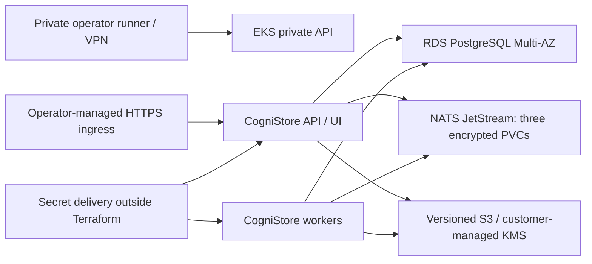

# AWS Terraform production reference

[`examples/terraform/aws`](../examples/terraform/aws) is the supported AWS
reference for the [production Helm chart](kubernetes.md). It provisions the
infrastructure; operators separately install dependencies, publish runtime
Secrets, and install the application. CI validates configuration and mocked
plans without credentials or resource creation. Passing CI is not evidence of
a live deployment, disaster recovery, or an AWS security assessment.

## Topology and ownership



The VPC has three public subnets for zonal NAT gateways, three private node
subnets, and three isolated database subnets. Nodes have no public addresses;
database subnets have no default internet route. An S3 gateway endpoint carries
regional S3 traffic. NAT provides outbound connectivity for image pulls,
regional STS, identity-provider discovery/JWKS, and other approved HTTPS
dependencies. This is an internet-egress topology, not an air-gapped cluster.

Terraform owns the VPC, EKS control plane and managed nodes, network-policy and
EBS CSI add-ons, encrypted Multi-AZ RDS PostgreSQL, object buckets, workload IAM
role, KMS key, and an empty runtime Secrets Manager container. It does not install Helm
releases, an ingress controller, DNS records, certificates, metrics server,
node autoscaler, secret synchronizer, or a VPN. The NATS Helm values supplied
below define the separately managed queue dependency. Keep cloud infrastructure,
state bootstrap, and application releases in separate lifecycles.

The EKS endpoint is private. Run Kubernetes and Helm operations from a runner
inside the VPC or through an existing routed private connection, using the
configured cluster-admin role and an allowed operator CIDR. Security-group
permission does not create routing or private DNS access. See the
[EKS endpoint access requirements](https://docs.aws.amazon.com/eks/latest/userguide/cluster-endpoint.html).

## Versions, inputs, and state

Terraform supports `>= 1.11.0, < 2.0.0`; CI uses `1.15.9`. The AWS provider is
pinned to `6.28.0`, with dependency checksums committed. Use Helm 3 and a kubectl
version compatible with the selected cluster. The separate NATS dependency is
pinned to chart `2.14.6`; supply tested immutable image digests for both NATS
and CogniStore. Review and pin regional EKS add-on builds and the node AMI
release before qualifying a deployment. Terraform's provider lock does not pin
managed-service versions or container images.

[`variables.tf`](../examples/terraform/aws/variables.tf) is the complete input
contract. No variable accepts a password or private key.

| Input | Purpose / default |
| --- | --- |
| `account_id`, `region`, `name` | Required account guard, region, and unique environment prefix. |
| `availability_zones` | Exactly three distinct standard zones in the selected region, in stable order. Changing their order changes derived subnet CIDRs. |
| `vpc_cidr` | Nonoverlapping IPv4 `/16`; defaults to `10.72.0.0/16`. |
| `operator_cidrs`, `cluster_admin_role_arn` | Required private API access networks and existing operator IAM role. |
| `kubernetes_version` | EKS minor; defaults to `1.35`. Verify regional availability and support dates. |
| `addon_versions`, `node_release_version` | Optional exact versions; null chooses the service's default/current build at creation. Pin resolved versions for reproduction. |
| `node_instance_type`, `node_capacity` | `m7i.large`, with minimum/desired/maximum `3/3/6`; no automatic node scaler. |
| `postgres_version`, `database_instance_class` | PostgreSQL `17.11`, `db.m7g.large`; verify pgvector `>= 0.8.0` on the selected engine. |
| `database_storage_gib` | `100` GiB starting capacity; increasing storage cannot later be undone by reducing this value. |
| `tags` | Nonsecret owner, billing, and operational labels. |

Bootstrap the state bucket and its KMS key with an independent platform stack.
Require encryption, versioning, public-access blocking, TLS, tightly scoped
operator access, and a recovery owner. Keep that bucket and key outside the
resources managed by this example. Copy `backend.hcl.example` to an ignored
`production.tfbackend`, set the existing bucket, region, key ARN and a unique
environment state key, and retain `encrypt = true` and `use_lockfile = true`.
Grant the Terraform principal access to the state object, KMS key, and its
`.tflock` object. Never disable locking to work around a concurrent operation.
See [S3 backend configuration and permissions](https://developer.hashicorp.com/terraform/language/backend/s3).

Use separate state keys and input files for environments; a name change alone
does not isolate state. Obtain short-lived AWS credentials through your normal
SSO/assume-role workflow. Never put credentials in backend files, Terraform
variables, outputs, provider configuration, or committed files. State and saved
plans remain sensitive infrastructure inventories even though this example
never reads runtime secret values. Protect CI logs and plan artifacts too.

Before applying, inspect the region's configured default EBS encryption key:

```bash
aws ec2 get-ebs-default-kms-key-id --region YOUR_REGION
```

The node launch template and storage class request encryption without specifying
a key, so both use this account/region default. The reference assumes the
AWS-managed `aws/ebs` key. If your organization configured a customer-managed
default, prepare the CSI role's KMS permissions and grants, plus the Auto Scaling
service-linked role's key-policy permissions and grants, before provisioning
nodes or PVCs. Do not change the account default to bypass organizational policy.
See [EBS encryption defaults](https://docs.aws.amazon.com/ebs/latest/userguide/encryption-by-default.html)
and [Auto Scaling encrypted-volume key policies](https://docs.aws.amazon.com/autoscaling/ec2/userguide/key-policy-requirements-EBS-encryption.html).

From the repository root, after reviewing and completing both example files:

```bash
cp examples/terraform/aws/terraform.tfvars.example examples/terraform/aws/production.tfvars
cp examples/terraform/aws/backend.hcl.example examples/terraform/aws/production.tfbackend
# Edit the copies before these commands.
terraform -chdir=examples/terraform/aws init -backend-config=production.tfbackend
terraform -chdir=examples/terraform/aws plan -var-file=production.tfvars -out=production.tfplan
# Review the complete saved plan and its cost before an authorized apply.
terraform -chdir=examples/terraform/aws apply production.tfplan
```

For local verification, install Terraform, Helm and Python 3, then run
`./scripts/terraform/verify.sh` from the repository root. Evidence is written to
`test-results/terraform/` (override with `COGNISTORE_TERRAFORM_OUTPUT`).
The script and CI use `init -backend=false`, `fmt -check`, `validate`, and `terraform test`
with a mocked AWS provider. This checks plans and invariants without contacting
AWS. A real account plan still needs account permissions and regional service
availability; it does not prove subnet routing, quota, TLS, or application health.


## Infrastructure-to-Helm handoff

[`outputs.tf`](../examples/terraform/aws/outputs.tf) supplies the cluster access
details, private database endpoint and managed master-secret ARN, bucket and
KMS identifiers, workload role, runtime secret-container ARN, and these
nonsecret rendered files:

| Output | Destination / use |
| --- | --- |
| `helm_values` | Production values with workload identity, CPU HPA and database/NATS/HTTPS policy. Replace every `REPLACE_*` field. |
| `drivers_yaml` | S3 tier with the output KMS key and standard workload credential chain. |
| `storage_class_yaml` | Encrypted gp3 EBS, delayed binding, expansion and `Retain`. |
| `migration_network_policy_yaml` | DNS and database egress for the pre-install migration hook. Apply before Helm. |

`database` contains `host`, `port`, `name`, and `admin_secret_arn`;
`object_storage` contains `bucket` and `kms_key_arn`; `runtime_secret_arn`
identifies the empty runtime container. `cluster_name`, `region`, `vpc_id`,
`node_subnet_ids`, `database_subnet_cidrs`, and `workload_role_arn` identify
the infrastructure. `resolved_versions` records the deployed engine, node and
add-on versions for qualification and subsequent explicit version pins.

Create a protected working directory outside the repository and store the
rendered files there. Set `COGNISTORE_DEPLOY_DIR` to its absolute path and
`COGNISTORE_OPERATOR_ROLE_ARN` to the configured `cluster_admin_role_arn`.
From the repository root, configure kubeconfig and render the handoff:

```bash
umask 077
aws eks update-kubeconfig \
  --name "$(terraform -chdir=examples/terraform/aws output -raw cluster_name)" \
  --region "$(terraform -chdir=examples/terraform/aws output -raw region)" \
  --role-arn "$COGNISTORE_OPERATOR_ROLE_ARN"
terraform -chdir=examples/terraform/aws output -raw helm_values > "$COGNISTORE_DEPLOY_DIR/values.yaml"
terraform -chdir=examples/terraform/aws output -raw drivers_yaml > "$COGNISTORE_DEPLOY_DIR/drivers.yaml"
terraform -chdir=examples/terraform/aws output -raw storage_class_yaml > "$COGNISTORE_DEPLOY_DIR/storage-class.yaml"
terraform -chdir=examples/terraform/aws output -raw migration_network_policy_yaml > "$COGNISTORE_DEPLOY_DIR/migration-network-policy.yaml"
kubectl create namespace cognistore
kubectl apply -f "$COGNISTORE_DEPLOY_DIR/storage-class.yaml"
kubectl apply -f "$COGNISTORE_DEPLOY_DIR/migration-network-policy.yaml"
```

Confirm EKS node readiness, enabled CNI policy enforcement,
and a ready EBS CSI controller. The storage class uses the account/region's
configured default EBS key, as checked before apply; introducing a customer-managed
key requires the permissions and grants described above. See
[EBS CSI permissions](https://docs.aws.amazon.com/eks/latest/userguide/ebs-csi.html).
Install [metrics server](https://docs.aws.amazon.com/eks/latest/userguide/metrics-server.html)
before enabling the supplied CPU HPA. This pinned HA manifest uses metrics
server `0.9.0`, which supports Kubernetes `1.34+`; recheck compatibility if
changing the cluster version. Review the downloaded file before applying it:

```bash
curl --fail --location \
  'https://github.com/kubernetes-sigs/metrics-server/releases/download/v0.9.0/high-availability-1.21%2B.yaml' \
  --output "$COGNISTORE_DEPLOY_DIR/metrics-server.yaml"
kubectl apply -f "$COGNISTORE_DEPLOY_DIR/metrics-server.yaml"
kubectl -n kube-system rollout status deployment/metrics-server --timeout=5m
kubectl top nodes
```

Confirm control-plane access to the metrics server and metrics-server access to
node kubelets on TCP 10250; do not bypass kubelet certificate verification.
See the [metrics-server compatibility and network contract](https://github.com/kubernetes-sigs/metrics-server/blob/master/README.md).
Keep one schedulable node in each of three zones for NATS.

The release and namespace must both be `cognistore`, and `fullnameOverride`
must remain `cognistore`: IAM trust binds the role to that exact service account.
Values project a separate `sts.amazonaws.com` token and set the standard AWS
web-identity environment variables. Ordinary Kubernetes API token automounting
remains disabled. The role can access only the provisioned object buckets and
their encryption key; it cannot fetch database passwords or administer KMS.
Version-specific reads are allowed for pinned object retrieval, but the role
cannot permanently delete S3 object versions.

The network policy allows DNS, TCP 5432 to database subnets, TCP 4222 to the
NATS release, and the chart's HTTPS smoke test. Public TCP 443 is a deliberate
allowance for S3, STS and issuer/JWKS endpoints; standard NetworkPolicy cannot
express hostname allowlists. Tighten it with an approved egress proxy/firewall,
or maintained destination CIDRs. Add explicit private CIDRs for a private IdP.
Replace the ingress-controller selectors with actual labels and namespace;
ingress remains disabled until reviewed HTTPS upstream configuration and a
certificate are supplied. Test allowed and denied traffic in the deployed CNI.
The VPC CNI uses standard enforcement mode: a newly starting pod can briefly
pass traffic before its policies are programmed. Strict enforcement requires
preparing system-namespace and bootstrap policies, including CoreDNS, before
changing that setting. See [CNI enforcement modes](https://docs.aws.amazon.com/eks/latest/userguide/cni-network-policy-configure.html).

### Prepare PostgreSQL and runtime Secrets

RDS manages its master password in Secrets Manager. Use the master-secret ARN
through a privileged operator workflow to connect over verified TLS from a
trusted in-cluster operator pod/job, then
create a dedicated `cognistore` login that owns the application database and
can create tenant schemas. Preinstall `vector` as a database administrator;
check `SELECT extversion FROM pg_extension WHERE extname = 'vector';` returns
at least `0.8.0`. Do not give the application the RDS master login. Confirm the
role can run catalog migrations and that TLS-only database access is enforced.
The database security group accepts the EKS node/pod security group only;
the private API runner/VPN has no direct database permission. Deliver bootstrap
credentials to the short-lived operator job through your secret workflow and
remove them when provisioning is complete.

Use the emitted RDS hostname in the DSN, with `sslmode=verify-full`, and the
appropriate [RDS CA bundle](https://docs.aws.amazon.com/AmazonRDS/latest/UserGuide/UsingWithRDS.SSL.html).
The runtime credentials Secret contains these environment-variable keys:

| Key | Value supplied by the secret workflow |
| --- | --- |
| `COGNISTORE_CATALOG_DB` | `postgresql://cognistore@<RDS endpoint>:5432/cognistore?sslmode=verify-full` |
| `PGPASSWORD` | Dedicated application-role password; never the master password. |
| `COGNISTORE_NATS_URL` | `tls://<URL-encoded user>:<URL-encoded password>@cognistore-nats.cognistore.svc.cluster.local:4222` |

Populate the empty runtime Secrets Manager container and synchronize the appropriate
keys into Kubernetes with your existing secret-delivery system. Terraform
intentionally creates no `aws_secretsmanager_secret_version` and no Kubernetes
Secrets. A manual bootstrap can use reviewed files on an encrypted operator
filesystem with restrictive permissions:

```bash
kubectl -n cognistore create secret generic cognistore-config \
  --from-file=drivers.yaml="$COGNISTORE_DEPLOY_DIR/drivers.yaml" \
  --from-file=encryption.json="$COGNISTORE_DEPLOY_DIR/encryption.json" \
  --from-file=authorization.json="$COGNISTORE_DEPLOY_DIR/authorization.json" \
  --from-file=tenants.json="$COGNISTORE_DEPLOY_DIR/tenants.json"
kubectl -n cognistore create secret generic cognistore-credentials \
  --from-env-file="$COGNISTORE_DEPLOY_DIR/runtime.env"
kubectl -n cognistore create secret generic cognistore-tls \
  --from-file=tls.crt="$COGNISTORE_DEPLOY_DIR/tls.crt" \
  --from-file=tls.key="$COGNISTORE_DEPLOY_DIR/tls.key" \
  --from-file=ca.crt="$COGNISTORE_DEPLOY_DIR/ca.crt"
```

Use [authorization](authorization.md) and [tenant bindings](tenancy.md) for real
issuer/subject identities. The API certificate must cover
`cognistore-api`, `cognistore-api.cognistore.svc`,
`cognistore-api.cognistore.svc.cluster.local`, and any hostname
used by the ingress's HTTPS upstream. The common CA bundle must trust the API,
NATS, RDS and configured HTTPS services, including necessary public roots.

Complete `encryption.json` using the [encryption contract](encryption.md): record
reviewed, unexpired `catalog`, `queue`, and `runtime` evidence. Include RDS
replicas/backups, every NATS PVC and backup, encrypted node root disks, temporary
and spool storage, and disabled/encrypted swap. Native AWS S3 does not require
a separate storage attestation; adding POSIX tiers or custom endpoints does.
Terraform settings are evidence inputs, not automatically valid attestations.
After credential/certificate/configuration rotation, increment `config.revision`
and upgrade the application; rotate NATS with a controlled StatefulSet restart.

### Install the persistent NATS dependency

Copy [`helm/nats-values.yaml`](../examples/terraform/aws/helm/nats-values.yaml)
to the protected deployment directory and replace its image digest. It installs
three brokers, one per zone, persistent encrypted volumes, TLS-first client
connections, mutually authenticated TLS routes, password authentication and
private HTTPS monitoring. Client server discovery is disabled; the stable
Service is the application's reconnect endpoint. See
[NATS TLS configuration](https://docs.nats.io/learn/security/encryption).

Create `cognistore-nats-auth` with `username` and `password` keys, and
`cognistore-nats-tls` with `tls.crt`, `tls.key`, and `ca.crt`, using the same
file-based workflow. The broker certificate needs server and client
authentication usages and SANs for
`cognistore-nats.cognistore.svc.cluster.local` and
`*.cognistore-nats-headless.cognistore.svc.cluster.local`. Keep this broker
deployment dedicated to the CogniStore release; its trusted application user
can administer its streams. Restrict who may create operator-labeled pods.

```bash
helm repo add nats https://nats-io.github.io/k8s/helm/charts/
helm repo update nats
helm template cognistore-nats nats/nats --version 2.14.6 -n cognistore \
  -f "$COGNISTORE_DEPLOY_DIR/nats-values.yaml" > "$COGNISTORE_DEPLOY_DIR/nats-rendered.yaml"
helm upgrade --install cognistore-nats nats/nats --version 2.14.6 -n cognistore \
  -f "$COGNISTORE_DEPLOY_DIR/nats-values.yaml" --wait --timeout 10m
```

Before starting the application, create both streams from the supplied
[`jetstream-jobs.json`](../examples/terraform/aws/helm/jetstream-jobs.json) and
[`jetstream-dlq.json`](../examples/terraform/aws/helm/jetstream-dlq.json). These
match the application's retention and size defaults and set `num_replicas: 3`.
Three broker pods alone do not replicate an application-created stream, which
otherwise uses the server's default replica count.

From a trusted operator pod in `cognistore`, labeled
`cognistore.io/queue-operator: "true"`, use a NATS CLI context that mounts the
credentials and CA, verifies the Service hostname, and enables `--tlsfirst`:

```bash
nats --context cognistore-operator stream add --config jetstream-jobs.json
nats --context cognistore-operator stream add --config jetstream-dlq.json
nats --context cognistore-operator stream info COGNISTORE_JOBS
nats --context cognistore-operator stream info COGNISTORE_JOBS_DLQ
```

Verify all replicas are current and rehearse broker loss. The DLQ has 30-day
retention with no message/byte limit; size the PVCs for failed-job traffic and
alert before disk exhaustion. Keep monitoring restricted to operators. Worker
KEDA scaling is disabled; enabling it requires a separately installed KEDA
controller, trusted monitoring TLS, and explicit monitoring network rules.

### Install and verify CogniStore

Complete all remaining placeholders in the rendered application values and
review the exact manifests:

```bash
helm lint helm/cognistore -f "$COGNISTORE_DEPLOY_DIR/values.yaml"
helm template cognistore helm/cognistore -n cognistore \
  -f "$COGNISTORE_DEPLOY_DIR/values.yaml" > "$COGNISTORE_DEPLOY_DIR/rendered.yaml"
helm upgrade --install cognistore helm/cognistore -n cognistore \
  -f "$COGNISTORE_DEPLOY_DIR/values.yaml" --wait --timeout 10m
helm test cognistore -n cognistore --logs
kubectl -n cognistore get pods,hpa,pvc
```

Verify a synthetic authenticated upload/download using an output bucket name,
an asynchronous job, tenant isolation, migration completion, RDS hostname
verification, NATS reconnect, and denied plaintext/untrusted TLS connections.
Check S3 version and KMS metadata and workload-role identity. The S3 tier does
not fix a bucket in YAML; each API operation supplies a bucket, and IAM limits
which names are accessible. Enable client-facing ingress only after end-to-end
TLS and authorization checks pass.

## Capacity, cost, backups, and upgrades

The default floor includes an EKS control plane, three EC2 nodes, three NAT
gateways and public IPv4 addresses, a Multi-AZ RDS instance, database storage,
three 20-GiB NATS volumes, S3 versions/requests, KMS, secret storage, and logs.
Estimate regional prices and expected data transfer with your approved cost
tool before applying. EKS extended support, retained backups, old S3 versions,
cross-zone traffic and NAT processing can materially increase the bill. Tags
support allocation; this example does not install budgets or billing alarms.

CPU HPA scales the API from two to six replicas. Two workers are static until
an operator changes their replica count or qualifies KEDA. HPA does not add
nodes: scale `node_capacity` or deploy a separately managed node autoscaler.
Retain capacity in every NATS zone, headroom for rollouts, and sufficient RDS
connections. Bound S3 concurrency and memory against measured workloads. The
recurring scheduler remains disabled; enabling it restores the chart's shared
single-node SQLite constraint and requires separate state backup.

Treat RDS Multi-AZ and NATS replication as availability, not backup. The example
retains 35 days of RDS automated backups, preserves them on instance deletion,
and requires a final snapshot. Retain reviewed manual snapshots, export all tenant schemas
when using logical backups, and restore into an isolated encrypted database.
Snapshot both JetStream streams with their supported backup process and retain
consumer state as required by the recovery procedure. CSI snapshots require
an independently installed snapshot controller. S3 versioning preserves object
history but does not coordinate a catalog/queue restore or provide immutable
backup. Keep keys available for every retained version, snapshot and export.

Rehearse restoration of a coherent catalog, object version inventory and queue
state; verify checksums and recover pending jobs before resuming producers.
Keep backup destinations encrypted, independently access-controlled, and outside
the application's destruction scope. See [encryption recovery](encryption.md)
and [catalog operations](postgres_catalog.md). Before upgrades, record image,
provider, engine, add-on and AMI versions; test migrations and recovery. A Helm
rollback does not undo a database migration.

## Destruction and retention

This reference is intentionally resistant to accidental data deletion. Review
the resource lifecycle guards and service deletion protection before any
decommission. `terraform destroy` is not a cleanup recipe for production data.

1. Stop ingress and producers, drain or record pending jobs, and stop workers.
   Take and verify catalog, JetStream, object inventory and optional scheduler
   backups. Record the retained encryption keys and a tested recovery identity.
2. Uninstall application and NATS releases only after the recovery checkpoint.
   Inventory PVCs, `Retain` PVs, EBS volumes, snapshots, load balancers and
   Kubernetes-managed network interfaces; they can survive Helm removal and
   block VPC deletion. Delete retained volumes only after their data is no
   longer needed. Remove Kubernetes dependencies before the EKS API disappears.
3. For an approved decommission, make an explicit reviewed change to Terraform
   lifecycle guards and RDS deletion protection. Check that the final snapshot
   identifier (`<name>-catalog-final`) is unused; choose a fresh one if it already
   exists, and retain the final snapshot. Do not add `force_destroy` or
   bulk-empty versioned buckets as a routine workaround. Deleting current S3
   objects alone leaves older versions and delete markers.
4. Review a saved destroy plan with the recovery owner before applying it.
   Runtime-secret deletion has a 30-day recovery window and KMS deletion has a
   30-day waiting period, but a disabled or deleted KMS key can
   make retained object versions and backups unreadable. Preserve required keys,
   final snapshots, exported Secrets and externally managed backups deliberately.
5. Audit separately retained resources and costs after removal. Preserve the
   independent state bucket, its versions, lock configuration and key until the
   infrastructure records and recovery obligations are formally retired.
